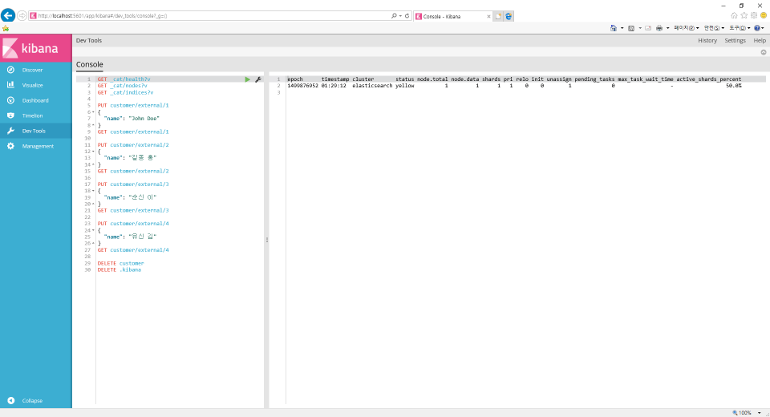

## [Elastic Stack](https://github.com/colaboy2010/ElasticStack/blob/master/README.md) > Elasticsearch

* Kibana Dev Tools  

* [클러스터 및 인덱스](https://github.com/colaboy2010/ElasticStack/blob/master/Elasticsearch/ClusterIndex.md)
* [문서 버전](https://github.com/colaboy2010/ElasticStack/blob/master/Elasticsearch/Version.md)
* [문서 수정, 삭제, 배치 처리](https://github.com/colaboy2010/ElasticStack/blob/master/Elasticsearch/ModifyDocument.md)
