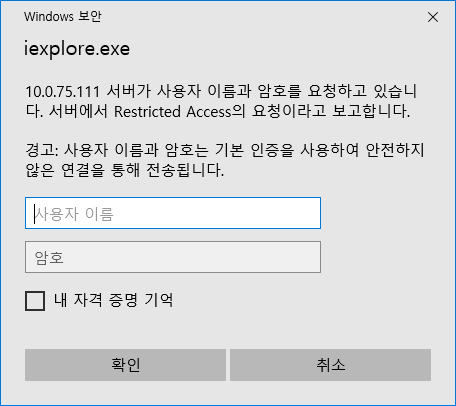
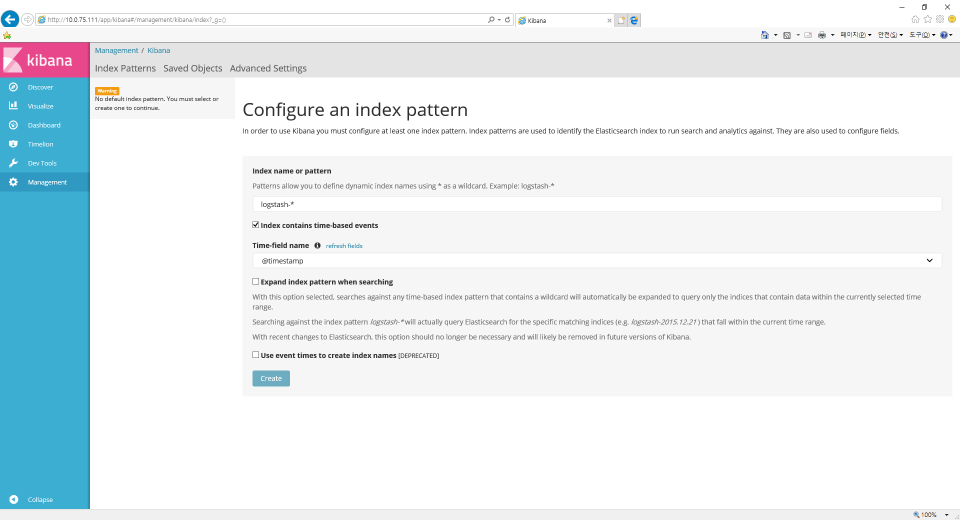

## [Elastic Stack](https://github.com/colaboy2010/ElasticStack/blob/master/README.md) > [Elastic Stack 설치](https://github.com/colaboy2010/ElasticStack/blob/master/Install/README.md) > Kibana 인증 설정 with nginx

### HTTP Authentication 설정

* HTTP Authentication 설치
```
 sudo apt-get install apache2-utils
```

* 사용자 파일(htpasswd.users) 생성 및 사용자 추가
```
sudo htpasswd -c /etc/nginx/htpasswd.users kibanaadmin
```

* 사용자 파일(htpasswd.users)에 사용자 추가
```
sudo htpasswd /etc/nginx/htpasswd.users user01 
```

### nginx proxy_pass 설정

* nginx / 경로를 http://localhost:5601 pass로 설정
```
sudo vi /etc/nginx/sites-available/default
```
```
        # Add index.php to the list if you are using PHP
        index index.html index.htm index.nginx-debian.html;

        server_name _;

        #location / {
                # First attempt to serve request as file, then
                # as directory, then fall back to displaying a 404.
        #       try_files $uri $uri/ =404;
        #}

        auth_basic "Restricted Access";
        auth_basic_user_file /etc/nginx/htpasswd.users;

        location / {
              proxy_pass http://localhost:5601;
              proxy_http_version 1.1;
              proxy_set_header Upgrade $http_upgrade;
              proxy_set_header Connection 'upgrade';
              proxy_set_header Host $host;
              proxy_cache_bypass $http_upgrade;
        }

```

* nginx 재시작
```
sudo service nginx restart
```

### kibana 실행

* 5601 Port 막고 80 port로 실행
* 브라우저에서 Kibana 서버로 접속 (http://10.0.75.111/)
* 로그인 화면  

* kibana 메인 화면 
